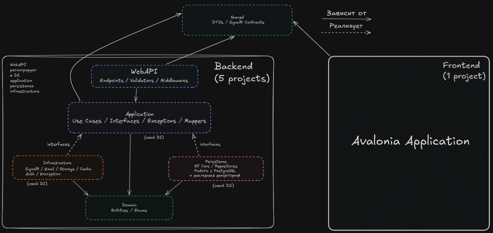

# VOID

> From nothing — everything.

VOID — полнофункциональное приложение для обмена сообщениями,
разработанное на C#/.NET с отдельным desktop-клиентом на Avalonia UI.

Проект построен с использованием принципов Clean Architecture,
разделения ответственности и Dependency Injection.

## Архитектура



### Backend

Backend разделён на несколько проектов:

- **WebAPI** — HTTP endpoints, middleware, validators и конфигурация DI.
- **Application** — use cases, интерфейсы, исключения и маппинг.
- **Domain** — доменные сущности и перечисления.
- **Infrastructure** — внешние интеграции: авторизация, шифрование,
  email, storage, cache и т.д.
- **Persistence** — Entity Framework Core, repositories и работа с PostgreSQL.

### Frontend

- **Avalonia Application** — desktop-клиент приложения.

### Shared

- **Shared Contracts** — DTO и контракты, используемые между frontend и backend.

## Возможности

- Регистрация и авторизация
- JWT Access / Refresh Tokens
- Личные чаты
- Групповые чаты
- Отправка сообщений
- Удаление сообщений
- Массовое удаление сообщений
- Отправка изображений и видео
- Отправка голосовых сообщений
- Работа с медиафайлами
- Email-уведомления
- Real-time коммуникация через SignalR
- События приложения
- Фоновые задачи
- Кэширование
- Миграции базы данных

## Технологии

### Backend

- **C# / .NET 10**
- **ASP.NET Core 10 Minimal API** — backend API
- **Entity Framework Core** — ORM
- **PostgreSQL** — основная база данных
- **Redis** — кэширование
- **Wolverine** — CQRS, обработка команд, событий и сообщений
- **SignalR** — real-time коммуникация
- **JWT (Access / Refresh Tokens)** — аутентификация
- **Serilog** — структурированное логирование
- **AutoMapper** — маппинг объектов
- **Scalar** — документация API
- **BCrypt** — хеширование паролей
- **MailKit + SMTP (Gmail)** — отправка email
- **S3-compatible Storage (Beget)** — хранение медиафайлов
- **AES-256-GCM** — серверное шифрование сообщений

### Frontend

- **C# / .NET 10**
- **Avalonia UI** — desktop-приложение
- **MVVM + ReactiveUI** — архитектура клиентского приложения
- **SignalR** — real-time обновления
- **LibVLC** — воспроизведение видео
- **SoundFlow** — запись голосовых сообщений
- **Avalonia.Labs.Notifications** — desktop-уведомления
- **AnimatedImage.Avalonia** — работа с GIF
- **AsyncImageLoader.Avalonia** — загрузка и кэширование изображений (Memory / Disk)
- **Iciclecreek.Avalonia.Controls.Media** — интеграция видеокомпонентов

### Testing

- **xUnit v3** — unit-тестирование

### Infrastructure

- **Docker** — контейнеризация
- **Docker Compose** — запуск и управление сервисами
- **Nginx** — reverse proxy
- **Beget** — hosting

## Структура проекта

```text
VOID
├── src
│   ├── Backend
│   │   ├── VOID.API
│   │   ├── VOID.Application
│   │   ├── VOID.Domain
│   │   ├── VOID.Infrastructure
│   │   └── VOID.Persistence
│   │
│   ├── Frontend
│   │   └── VOID.APP
│   │
│   └── Shared
│       └── VOID.Shared
│
├── tests
│   └── VOID.Application.UnitTests
│
├── docs
│   └── architecture.png
│
├── docker-compose.yml
└── README.md
